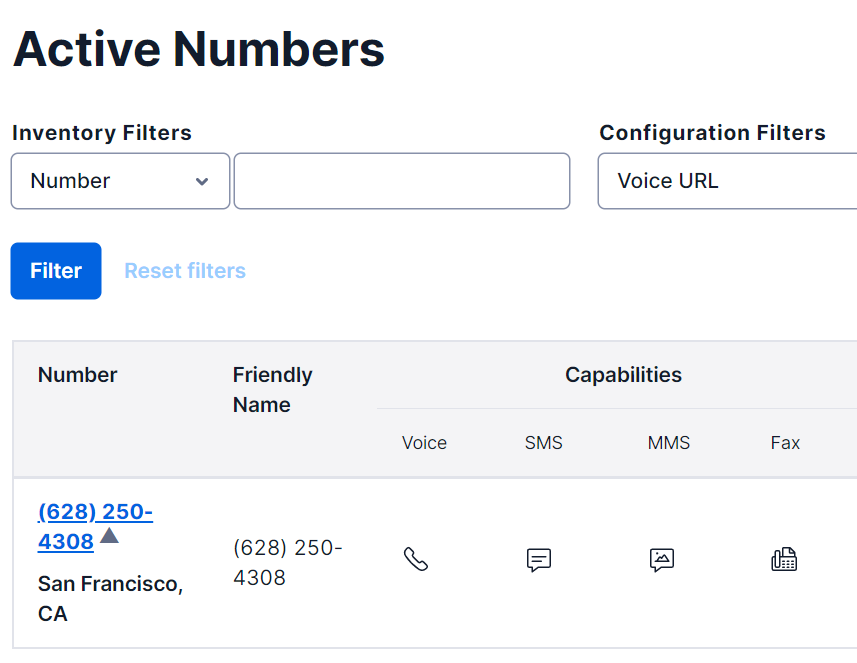

# SMS Verification Frontend
## How to run
### Run in terminal: 
- Clone the repository: `git clone git@github.com:ltn18/SMS-verification-frontend.git`
- Install node_modules/necessary packages: `npm i`
### Run Frontend
- To start the frontend, run in your terminal: `npm start`
- Your frontend will be running on: `http://localhost:3000`
## Testing
- Since we can only send messages from Twilio to verified users, I will test all the method with my phone number only. You may have to verify your phone number to effectively test.
### Demo Video and Pictures
- You can see the demo here: [sms-verification-with-twilio](https://drive.google.com/file/d/1rngYZDyGQx3ZAh40kQFis6a1fuJLE6BO/view?usp=sharing)
- I registerd the number `(628) 250-4308` on Twilio to send to myself the texts. 
- Here is the picture of the texts that is sent to me: 
- Here is the picture of my Active Number on Twilio: 

